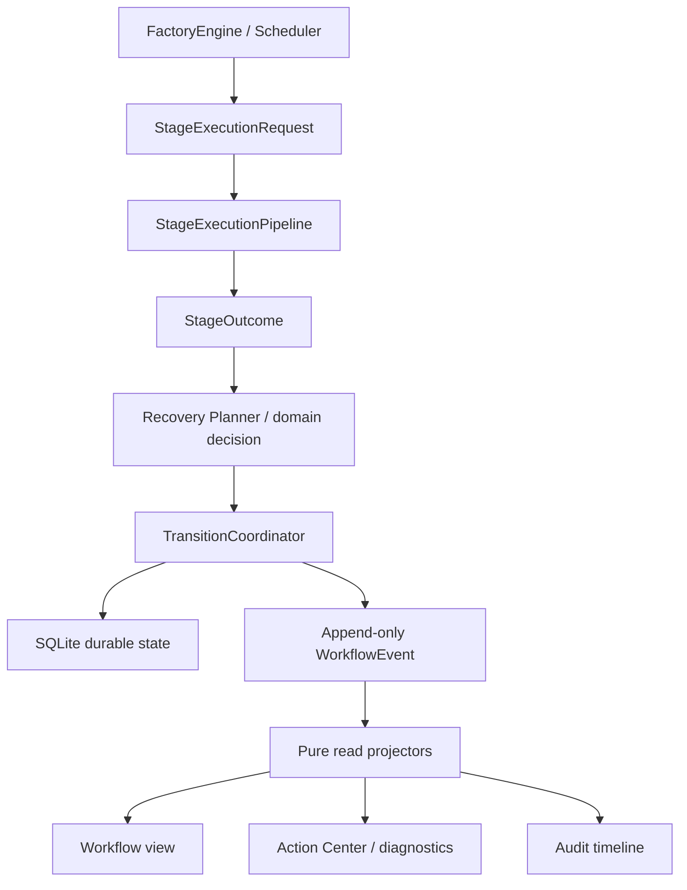

# 横向运行时基础设施收敛方案

> 状态：**R0–R4 核心合同及 schema-v9 审计加固已实现，运营验收待完成；R5 Capability/Profile 延后**
> （2026-08-16）。
>
> 本文描述在当前 10-Stage `stage_v1` 编排之上引入类型化 WorkflowEvent、纯读取
> Projector、StageExecutionPipeline、Human Decision 和持久 Job 身份的运行合同；R0–R4
> 已成为当前 Native 实现，Capability/Profile（R5）仍是后续目标设计。任何一层都不授权
> 绕过现有 `FactoryEngine`、Step validator、receipt、fingerprint、人工 Gate、deadline 或
> Final Audit。

## 1. 当前基线与范围

当前代码事实如下：

- 正常入口创建的新 Native 项目使用 `runtime_generation="native_v2"`、
  `scheduler_generation="stage_v1"` 和 `contest_core_v1`；10 个持久 Stage 是调度、checkpoint、
  retry 和 recovery 边界。
- Step 0–16 仍是 validator、budget、artifact、evidence 和兼容边界；Step 8.5 是 Stage 6
  的 reviewer-entry validation contract，不是数值型 workflow Step ID。
- 升级前已经存在的 Native 项目保持 `step_v2`，直到操作者在停止且可迁移的状态显式执行
  `scheduler-activate`。Legacy Adapter 继续保持冻结兼容路径。
- SQLite `events` 保持 append-only；schema v9 的所有新 transition 写入 event-v2
  `_workflow` 信封，记录 versioned state patch、前后状态哈希、主体/结果坐标、规范事件类型、
  结构化 reason 和 contest policy/project config/决策/dirty/checkpoint/Solver
  side-table aggregate root。
- Native Web 状态、Action Center、恢复状态和审计时间线从 SQLite 事件纯投影；只有 Legacy
  或 Native 数据库不可读时才回退到 `diagnostics/status.json`、heartbeat 和日志。

因此，本方案不改变 8 个用户阶段、10 个 Stage、Step 0–16、Step 8.5、Stage catalog 或
现有 artifact contract。它收敛的是横跨这些边界的执行、原因、恢复、诊断与审计基础设施。

## 2. 五条架构约束

所有实施必须同时满足：

1. **Scheduler 唯一决定下一项工作是什么。** `stage_v1` 以 Stage/subtask 为权威；
   `step_v2` 以 Step cursor 为权威，Stage 仅是兼容投影。
2. **StageExecutionPipeline 是统一的执行调用边界。** 当前它负责 deadline scope、
   prepare/execute/validate、异常规范化和 workflow-event 提取；lease、input fingerprint、
   freeze、human decision、evidence 与 audit guards 仍分别由 Engine、Step 和 Storage 执行。
   把这些 guards 继续收敛到 Pipeline 是后续目标，现状不得表述为已经完成。
3. **TransitionCoordinator 唯一修改 workflow durable state。** FactoryEngine 根据
   StageOutcome 和 Recovery Planner 的领域决定调用它；其他组件不得直接推进 cursor、清除
   dirty flag 或失效 checkpoint。
4. **WorkflowEvent 唯一解释为什么发生某次 durable 状态变化。** Artifact、receipt 和
   fingerprint 仍是机器证据权威；事件保存其不可变引用和哈希，不复制或替代证据。
5. **Projector 只读取事实，不产生领域决定。** Projector 不得重新选择 retry/reopen/await/fail，
   不得决定恢复目标，也不得写项目状态或外部系统。



## 3. 类型化 WorkflowEvent

### 3.1 事件信封

新事件使用 versioned、可验证的领域信封。实现将信封放在旧 payload 的 `_workflow` 命名空间，
以保持既有事件名和消费者兼容；最小结构是：

```python
WorkflowEventEnvelope(
    event_version=1,
    event_id="event-...",
    canonical_type="GATE_BLOCKED",
    revision=83,
    occurred_at=...,  # 展示与审计字段，不进入确定性状态哈希
    scheduler_generation="stage_v1",
    coordinate_authority="stage",
    stage_id=7,
    subtask="paper_audit",
    source_step_id=10,
    attempt=2,
    state_patch={...},
    state_hash_after="sha256:...",
    reason={...},
    side_effect_refs=[...],
)
```

`stage_v1` 事件以 `stage_id + subtask` 为调度坐标，`source_step_id` 是 Step 合同和兼容坐标。
`step_v2` 事件必须写 `coordinate_authority="step"`；其 Stage 值只能标记为 projected，不能让
只读映射冒充调度权威。旧事件保持不可变，由兼容 reducer 处理缺失字段。

### 3.2 `state_patch + state_hash_after`

稳态事件不重复保存整个 WorkflowState。每次 durable transition 记录：

- `state_patch`：本次实际改变且属于 replay contract 的字段；
- `state_hash_after`：对应用 patch 后的 versioned `WorkflowReplayState` 做 canonical JSON
  SHA-256；
- `checkpoint_effects`、`dirty_effects`、`decision_effects`、`job_effects`：仅在该领域操作实际
  影响对应状态时出现；
- reason、evidence 与 immutable receipt/artifact refs。

`WorkflowReplayState` 使用显式字段白名单和版本号。`runner_pid`、`runner_lease_id`、
`heartbeat_at`、`updated_at` 等进程/时钟字段不进入稳定状态哈希；如果 UI 需要它们，由独立
runtime-liveness view 提供。不得把 Python 对象默认序列化结果当作哈希合同。

新项目的首事件和旧事件流切换后的首个新事件写完整 replay snapshot；之后只写 merge patch。
reducer 对每一版 `state_hash_after` 校验，任何篡改或无 snapshot 的流均失败关闭。

### 3.3 Projector checkpoint

Projector 必须能从零重放。为控制大项目冷启动成本，可以按配置的 revision 间隔（例如 100）
写 `ProjectionSnapshot`：

```text
projector key + projector version + source revision + source event hash
+ canonical projected state
```

Snapshot 只是加速器，不是事实源。版本不匹配、revision 越界、hash 不符或读取失败时必须丢弃，
重新从 append-only event 重放。

### 3.4 事件类别

第一阶段只覆盖对 Gate、恢复、诊断和审计有直接价值的事件：

```text
SUBTASK_STARTED
SUBTASK_SUCCEEDED
GATE_BLOCKED
GATE_RESOLVED
HUMAN_DECISION_REQUESTED
HUMAN_DECISION_RECORDED
RECOVERY_PLANNED
CHECKPOINT_INVALIDATED
WORK_REOPENED
JOB_SUBMITTED
JOB_RECONCILED
JOB_FINISHED
AUDIT_RECORDED
SNAPSHOT_FROZEN
RELEASE_PUBLISHED
```

事件 schema 必须约束 reason code、evidence ref、recovery disposition 和 receipt ref，不允许
Web 或 CLI 从自由文本日志反向推断业务状态。

## 4. 纯读取 Projector

目标读模型包括：

- `WorkflowStateProjector`：在 shadow 阶段重建 versioned replay state 并核对
  `state_hash_after`；稳定前不取代 SQLite `project_state` 写模型。
- `ActionCenterProjector`：生成当前阻塞原因、证据、人工动作和可打开的 receipt/artifact。
- `AuditTimelineProjector`：串联 Gate、人工决定、恢复、audit snapshot 和 release。
- `RecoveryStatusProjector`：只展示已记录的恢复计划、失效 checkpoint、reopen 进度和当前等待；
  不计算恢复目标。

Projector contract 由纯同步 reducer 表达：

```python
init() -> ProjectedState
apply(state, event) -> ProjectedState
view(state) -> JsonValue
```

它不得读取项目文件、调用模型/Solver、访问当前时间、生成随机数、修改 SQLite 或触发恢复。
需要展示的结果期事实必须在事件或不可变 receipt ref 中持久化。

## 5. Human Decision，不把 Selection 混成 Approval

统一的父抽象是：

```text
HumanDecisionRequest
        ↓
HumanDecision
```

其下分为两种互不混淆的合同：

```text
SelectionDecision
└── Step 3 PRIMARY/AUXILIARY 选择

ApprovalDecision
├── content freeze
└── delivery freeze override
```

Step 3 必须保存结构化选择，而不是压缩成 approve/reject：

```python
HumanDecisionRequest(
    request_id="decision-128",
    kind="selection",
    gate="step3_primary_selection",
    revision=82,
    decision_schema={
        "primary": "candidate id",
        "auxiliary": ["candidate id"],
        "reason": "non-empty string",
    },
)
```

Freeze 类决定使用一次性 Approval：

```python
HumanDecisionRequest(
    request_id="decision-201",
    kind="approval",
    gate="delivery_freeze_override",
    revision=153,
    options=["allow_once", "reject"],
)
```

无可用决定通道、过期 revision、gate/request 不匹配或 fingerprint 改变时失败关闭。一次性批准
只授权绑定的动作、request generation、subject/options fingerprint 和 revision，不能永久关闭
freeze。Schema v9 的 `workflow_decision_requests` 保存每代请求，
`workflow_decision_instances` 保存不可变结果。每个结果只把
`.factory/decisions/<gate>/<request_id>/<decision_id>.json` 作为权威 artifact ref；
`selection/*_decision.json` 与 `human_review.md` 是可覆盖、可重建投影。Content freeze 被拒绝时
当前 pending 被清除、Stage 9 之后的 checkpoint 失效，工作流回到 Stage 9；修复与验证完成、
再次到达 Gate 后才创建绑定新 fingerprint 的下一代请求。仍停留在 Gate 的陈旧开放请求可通过
原子 supersede/rebind 操作换代。旧 `workflow_decisions` 仅为冻结迁移来源。

## 6. StageExecutionPipeline 调用边界与唯一状态写者

以下是目标 guard 收敛边界，并非当前全部实现。当前 Pipeline 已覆盖 deadline scope、
prepare、execute、validate、异常与事件提取；标注为 guard/capability/evidence/audit 的环节仍分布
在 Engine、Step 和 Storage，必须以运行代码为准：

```text
PreStage
  -> DeadlineGuard
  -> RunnerLeaseGuard
  -> InputFingerprintGuard
  -> FreezeGuard
  -> BudgetGuard
  -> HumanDecisionGuard
  -> CapabilityResolution
  -> Timeout/Telemetry wrappers
  -> subtask.execute()
  -> ValidationPipeline
  -> EvidenceGuard
  -> Audit hook
  -> Outcome normalization
  -> StageOutcome
```

Pipeline 的返回值只能描述事实和候选效果：

```python
StageOutcome(
    disposition="success | retry | reopen | await | fail",
    reason={...},
    evidence=[...],
    checkpoint_effects=[...],
    recovery_plan={...},
    job_refs=[...],
    audit_refs=[...],
)
```

Pipeline 不执行 SQLite transition。FactoryEngine 保留 scheduler 和 budget 权威；Recovery
Planner 根据领域合同确认 disposition/target；随后只有 `TransitionCoordinator` 可以在带
expected revision、runner PID 和 lease fence 的 transaction 中修改 durable state 并追加事件。

每一次领域操作只更新它实际影响的行。例如普通 `SUBTASK_SUCCEEDED` 不更新 human decision，
一次 approval 不更新 solver job。禁止为了“统一事务”无条件触碰所有状态表。

## 7. Artifact 与 SQLite 的提交边界

SQLite transaction 不能覆盖普通文件系统 artifact。需要持久证据的操作遵循：

```text
1. 在同一文件系统的 staging 写 immutable artifact / receipt
2. flush/fsync 必要内容
3. atomic rename 到内容寻址或不可变目标
4. 计算并验证 fingerprint
5. SQLite BEGIN IMMEDIATE
6. 更新本次操作实际影响的 durable state
7. 写 artifact/receipt refs 与 hash
8. append WorkflowEvent
9. COMMIT
```

若第 5–9 步失败，已发布但未被 SQLite 引用的文件是 orphan immutable artifact。Reconciliation
或有保留期的 GC 可以清理它；不得伪造一个跨文件系统与数据库的原子事务，也不得覆盖已引用
的 immutable receipt。

## 8. Recovery Planner 与恢复状态

真正决定 retry、reopen、await、fail、checkpoint invalidation 的仍是 FactoryEngine 的领域恢复
合同或显式 Recovery Planner。推荐的记录顺序是：

```text
GATE_BLOCKED
  -> RECOVERY_PLANNED
  -> revision/fingerprint/deadline/budget recheck
  -> CHECKPOINT_INVALIDATED（仅需要时）
  -> WORK_REOPENED / retry / await / fail
  -> GATE_RESOLVED（修复并复验后）
```

重放事件只能解释为什么失败、计划恢复到哪里、哪些 checkpoint 已失效和当前进度，不能再次
执行恢复命令。所有执行动作必须重新验证当前 revision、lease、fingerprint、deadline 和继承预算。

## 9. Job 身份、幂等与外部 reconciliation

持久 Job 合同扩展为：

```text
JobIdentity
├── job_id
├── idempotency_key
├── request_sha256
├── owner_stage
├── owner_subtask
├── owner_revision
└── attempt_id
```

`idempotency_key` 由 versioned canonical request 计算，例如：

```text
sha256(contract version + stage + subtask + input fingerprint
       + backend/runtime + script/code hash + argv + declared inputs/outputs/seeds)
```

数据库对当前有效身份施加唯一约束，但数据库唯一键只能阻止本地重复记录，不能单独关闭
“远端已接受、本地尚未记录 external_id 即崩溃”的窗口。Provider 必须支持下列至少一种能力：

1. 把同一个 idempotency key 传给远端并由远端去重；或
2. 通过 request fingerprint 查询/列举远端任务并 reconciliation；或
3. 在无法证明是否已提交时失败关闭并请求人工处理，不能盲目再次提交。

当前 `solver-job-evidence-v2` 的 `request_sha256` 同时包含随机 `job_id` 与 `requested_at`，因此
不能充当稳定的重复提交键。实现保留该哈希作为回执证据，另以 versioned canonical request
生成 `idempotency_key`；两者在 `solver_jobs` 中并列保存，不互相冒充。Cloud provider 同时接收
该 key，并可通过持久 `job_id` reconciliation 关闭“远端已接收、本地未确认”的窗口；本地无法
证明进程身份时失败关闭，不盲目重提。

## 10. Step 8.5 的非整数边界

Step 8.5 永远不写入数值型 `active_step`、`source_step_id` 或 `StepContract.id`。Stage 6 表达为：

```text
Stage 6 REVIEWER_ENTRY
├── visualization
│   └── source_step_id = 8
└── reviewer_entry_gate
    ├── source_step_id = 8
    └── validation_contract = "step8.5_reviewer_entry"
```

事件使用 `subtask="reviewer_entry_gate"` 和稳定字符串 `gate_id`。不得把 Step ID 类型从整数改成
float/string，也不得创建 `active_step=8.5`。

## 11. Capability、Profile 与 Scoped Registration

在事件和状态写边界稳定后，再渐进扩展当前 Registry：

```text
ModelCapability
SolverCapability
ValidationCapability
AuditCapability
AgentCapability
HumanDecisionCapability
```

Capability 表达可替换接口和真实支持事实，不等于权限、安全沙箱或进程隔离。Stage 声明需要的
能力，Profile 决定 provider 与 policy 组合；核心 scheduler 不硬编码 Codex、Claude、
DeepSeek、Cloud Run 或其他具体实现。

Scoped registration 只管理一个 Stage/Agent 生命周期内的临时 provider、listener、timer、连接或
进程清理。它不回滚工具已经写入的文件或外部系统副作用，也不替代 artifact/receipt 合同。

本轮不引入 Cordis 整套插件树，不把 DeepSeek Harness 作为运行时依赖，不用其进程内 Job
实现替换当前持久 Solver Job，也不把 Session log 直接当作 Workflow 状态机。

## 12. 目标运行流程

```text
FactoryEngine/Scheduler 选择 Stage/subtask
  -> 构建 StageExecutionRequest
  -> StageExecutionPipeline 运行 guards、能力、执行和验证
  -> 返回 StageOutcome
  -> Recovery Planner 确认领域 disposition/target
  -> 先固化 immutable artifact/receipt 并计算 fingerprint
  -> TransitionCoordinator 原子提交受影响的 SQLite 行和 WorkflowEvent
  -> 纯 Projector 增量更新 Workflow/Action Center/Audit/Recovery Status view
  -> Scheduler 根据新的 authoritative state 选择下一项工作
```

成功路径不会因为事件层改变 Stage/Step 编号。失败路径只重开责任 Stage/subtask，并继承原
Step timeout、attempt、reopen 和 contest deadline 预算。

## 13. 兼容迁移与实施顺序

### R0：合同锁定（已实现）

- 固定 event envelope、reason/evidence/recovery 枚举和 replay-state hash allowlist。
- 固定 Human Decision 的 selection/approval 子类型。
- 固定 Pipeline、Recovery Planner、TransitionCoordinator 和 Projector 的写权限边界。

### R1：事件增强与 shadow projector（已实现）

- 保持当前 `project_state`、scheduler 和 Web 路径为权威。
- 新 transition 追加 versioned patch/hash；旧事件通过兼容 reducer 读取，不回写。
- Shadow Projector 比较 replay hash、cursor、Action Center 和现有 runtime payload；差异只记录，
  不影响调度。

### R2：Human Decision 与 Native 诊断切换（已实现）

- Step 3 使用 SelectionDecision；freeze 使用 ApprovalDecision。
- Native Web/CLI 在 shadow parity 达标后切换到 Action Center/Audit Timeline projector。
- Legacy 保留现有 diagnostics/heartbeat/log fallback。

### R3：Pipeline 与唯一 TransitionCoordinator（已实现）

- 从 FactoryEngine 提取 guards/wrappers/validation orchestration，但 Pipeline 只返回 StageOutcome。
- 所有 durable 写集中到 TransitionCoordinator，保持 revision/PID/lease fence。

### R4：Job 幂等与 reconciliation（已实现）

- 增加 versioned idempotency key、唯一约束和 provider capability。
- 覆盖远端接受后本地崩溃、恢复查询、重复请求和无法证明时失败关闭。

### R5：Capability/Profile 渐进收敛（延后，非本轮上线依赖）

- 先适配现有 Model/Solver/Validation/Audit Registry；稳定后再增加 Agent provider、Profile 和
  scoped registration。
- 不以本轮为由迁移整个 Cordis/Harness 运行时。

## 14. 验收

聚焦迁移、重放哈希、Human Decision、Pipeline、诊断、Step 16 和 Solver 幂等回归已经纳入测试；
不需要为了代码集成先重跑旧题。以下运营验收仍必须在最终上线前完成：

```python
replay(events).state_hash == latest_event.state_hash_after
shadow.cursor == authoritative_cursor
shadow.action_center == native_diagnostics_contract
recorded_recovery_target == engine_selected_target
```

完成集成后再统一进行：

1. 一个全新 `contest_core_v1 + stage_v1` 历史赛题项目的无 override clean-room 运行，覆盖
   Stage 1–10、Step 0–16、正常 Human Decision、Final Audit、不可变 release 和原子
   `current.json` 切换；
2. 一个低成本、可丢弃的 Gate 阻塞—恢复演练，证明 reason/evidence、RecoveryStatus、责任
   subtask reopen、checkpoint invalidation 和 Audit Timeline 闭环；
3. `step_v2` 兼容事件、Legacy fallback、Projector snapshot 失效重放和 provider 幂等/无法
   reconciliation 时失败关闭的聚焦测试。

该运营验收必须对应最终准备上线的机制；模拟 lifecycle、注入 PASS receipt、交付 override 或
手工推进状态不能冒充 clean-room 证据。

## 15. DeepSeek Harness 借鉴边界

本方案借鉴 DeepSeek Harness 的 append-only typed event、纯 projection、执行管线、一次性
approval、capability seam、effect lifecycle 和 job ownership 思想。它们在本仓库中必须服从
比赛 deadline、Stage checkpoint、Step evidence、Human Decision、Final Audit 和原子 release
领域合同。

参考：

- [DeepSeek Harness architecture](https://github.com/deepseek-ai/deepseek-harness/blob/main/docs/architecture.md)
- [Session projection contract](https://github.com/deepseek-ai/deepseek-harness/blob/main/packages/session/session-projection/src/index.ts)
- [Tool execution pipeline](https://github.com/deepseek-ai/deepseek-harness/blob/main/docs/tool-execution-pipeline.md)
- [Cordis lifecycle and reversible effects](https://github.com/deepseek-ai/deepseek-harness/blob/main/docs/cordis-tutorial/02-lifecycle-and-effects.md)
